# xviz — Apache Superset's chart engine, unbundled

<p align="center">
  <a href="https://github.com/caiyin-bit/xviz/actions/workflows/ci.yml">
    
  </a>
  <a href="https://codecov.io/gh/caiyin-bit/xviz">
    
  </a>
  
  
</p>

<p align="center">
  <a href="./README.md">English</a> · <a href="./README.zh-CN.md">中文</a>
</p>

<p align="center">
  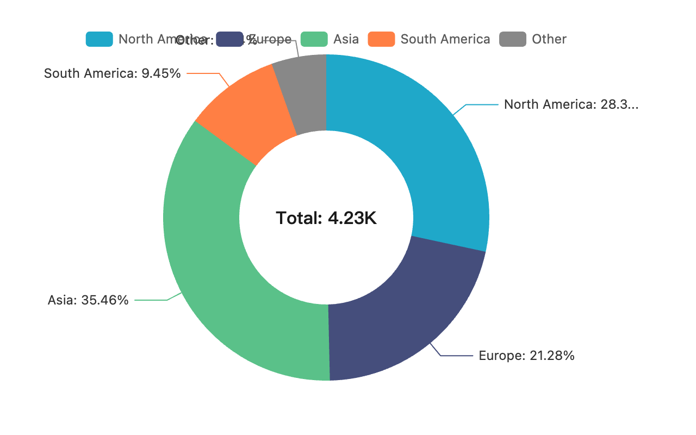
</p>

> The chart layer of Apache Superset, extracted into a standalone library.
> Use it as a React component, render it headlessly from JSON / CSV / SQL via
> the CLI, or hand it to an LLM agent over MCP. No BI platform, no metadata DB,
> no dashboards — just charts, **fifteen of them** (v0.4.0), plus a renderer
> that turns data into PNG / PDF / HTML.

## Three ways to use it

### 1 · As a React library

```bash
npm install @minimal-viz/core react react-dom echarts
```

```tsx
import { PieChart } from '@minimal-viz/core'

<PieChart
  width={600} height={400}
  formData={{ vizType: 'pie', groupby: ['region'], metric: 'sales', donut: true }}
  queriesData={[{ data: [
    { region: 'NA', sales: 1200 },
    { region: 'EU', sales:  900 },
    { region: 'AS', sales: 1500 },
  ]}]}
/>
```

Runs in any React 18+ app. Three runtime deps: `react`, `react-dom`,
`echarts`. ~5 KB gzipped (excluding peers).

See the [library docs →](./minimal-viz/README.md)

### 2 · As a CLI

```bash
npm i -g xviz-cli

# From JSON or CSV
xviz render -d data.csv -f form.json -o chart.png

# Straight from a database
xviz query --db sqlite:./orders.db \
  --sql "SELECT region, SUM(revenue) r FROM orders GROUP BY 1" \
  --form pie.json -o regions.png

# Or as an HTTP service — browser stays warm, ~1.2s/request
xviz serve --port 3737
```

Chrome or Chromium is required at runtime (`xviz` uses `puppeteer-core`,
no browser bundled). Set `XVIZ_CHROME=/path/to/chrome` if it isn't on the
default search path.

See the [CLI docs →](./xviz-cli/README.md) and the
[runnable examples →](./xviz-cli/examples/README.md)

### 3 · As an LLM tool (MCP)

Ask Claude *"chart these numbers as a donut"* and it calls `render_chart`
directly:

<p align="center">
  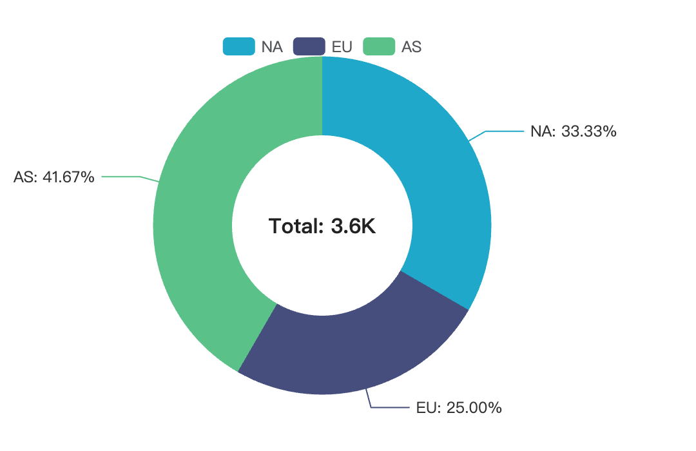
</p>

```json
{ "mcpServers": { "xviz": { "command": "npx",
  "args": ["xviz-cli", "mcp"] } } }
```

Drop that into your Claude Desktop config and Claude can render any of
the fifteen chart types on demand. Full walk-through in the
[MCP example](./xviz-cli/examples/mcp-claude-desktop/README.md).

## The charts

Fifteen chart types covering ~95% of everyday BI needs (as of v0.4.0).

| | | |
|:---:|:---:|:---:|
|  | 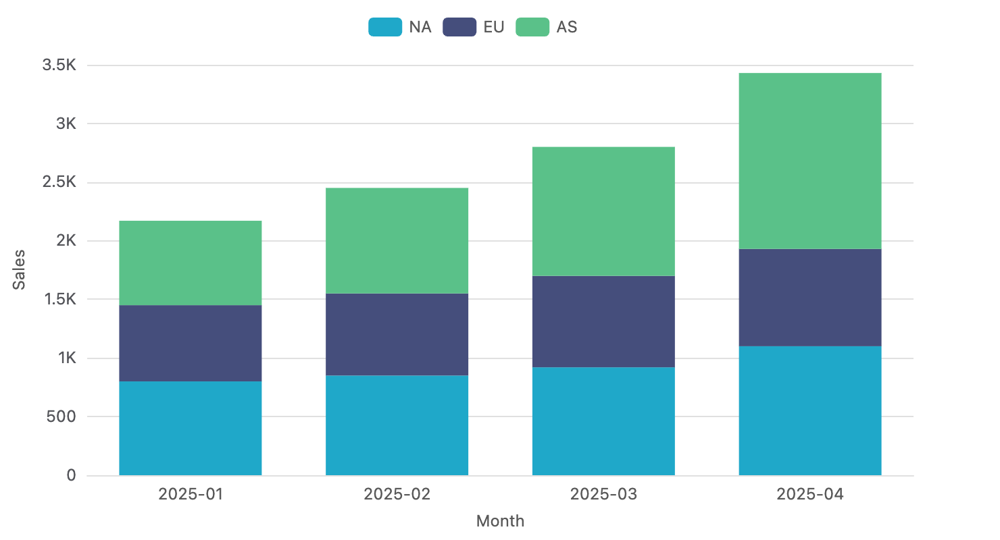 | 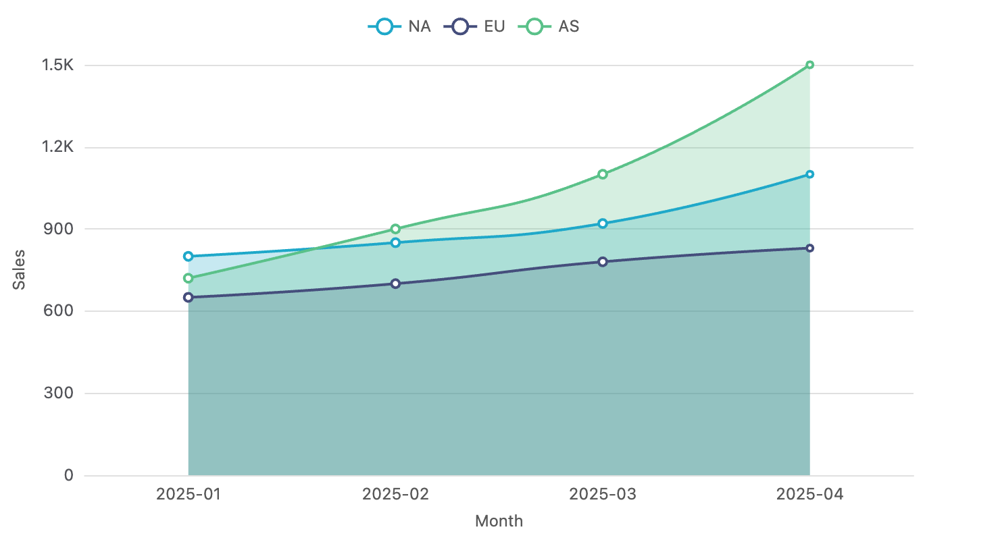 |
| **Pie / Donut** | **Bar (stacked)** | **Line (smooth + area)** |
| 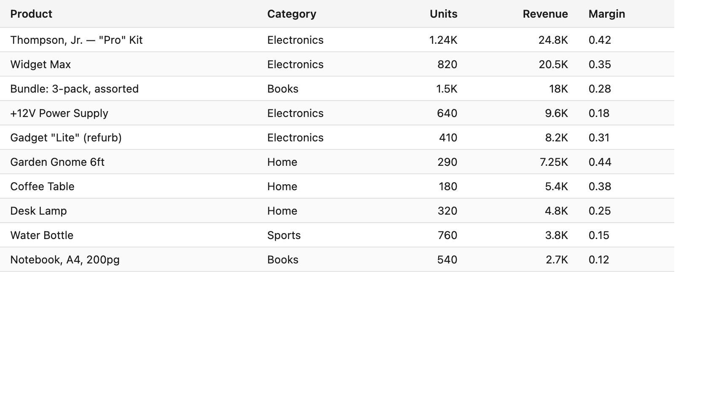 | 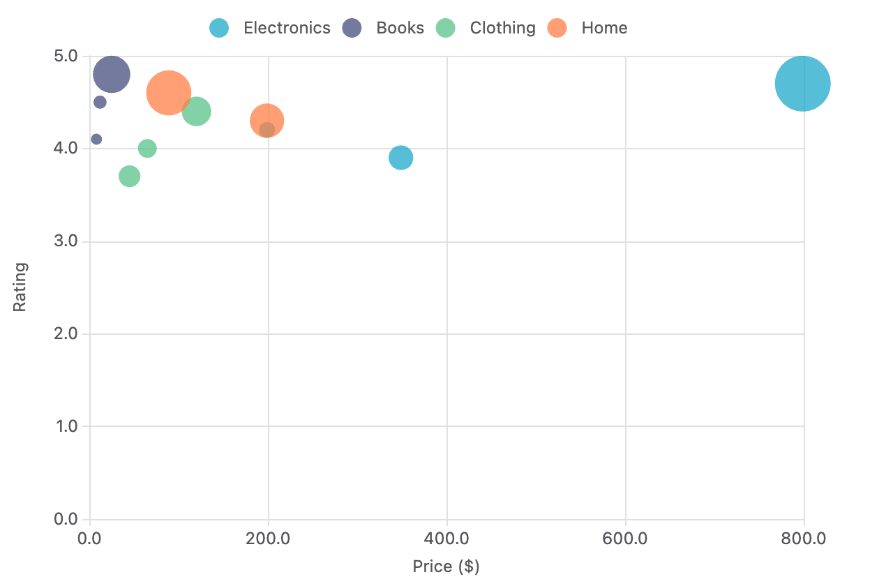 | 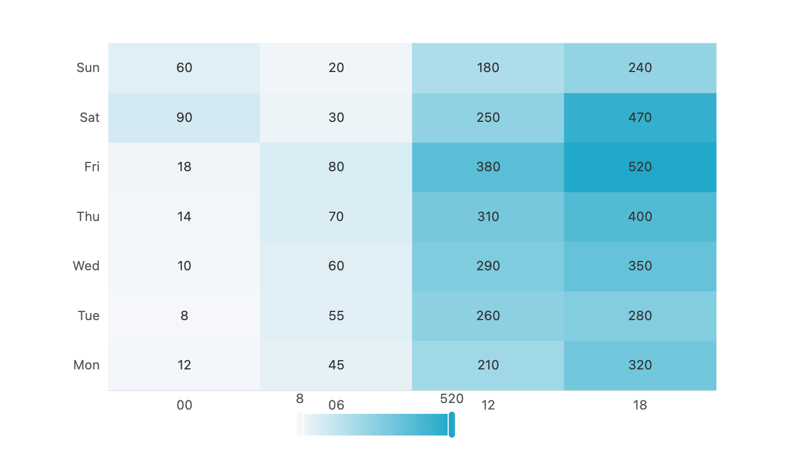 |
| **Table** | **Scatter / Bubble** | **Heatmap** |
| 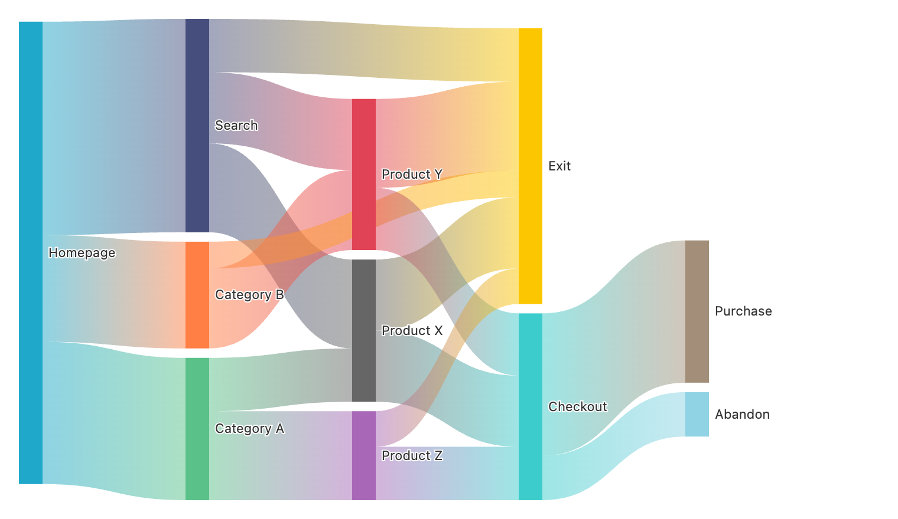 | 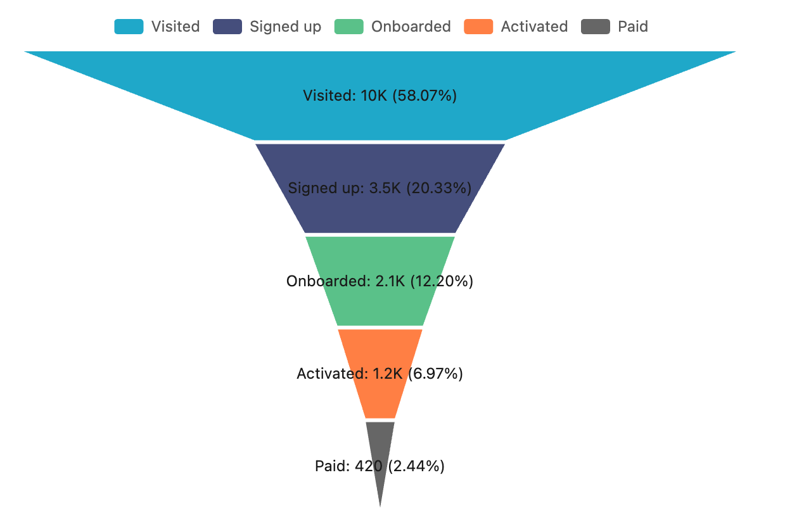 | 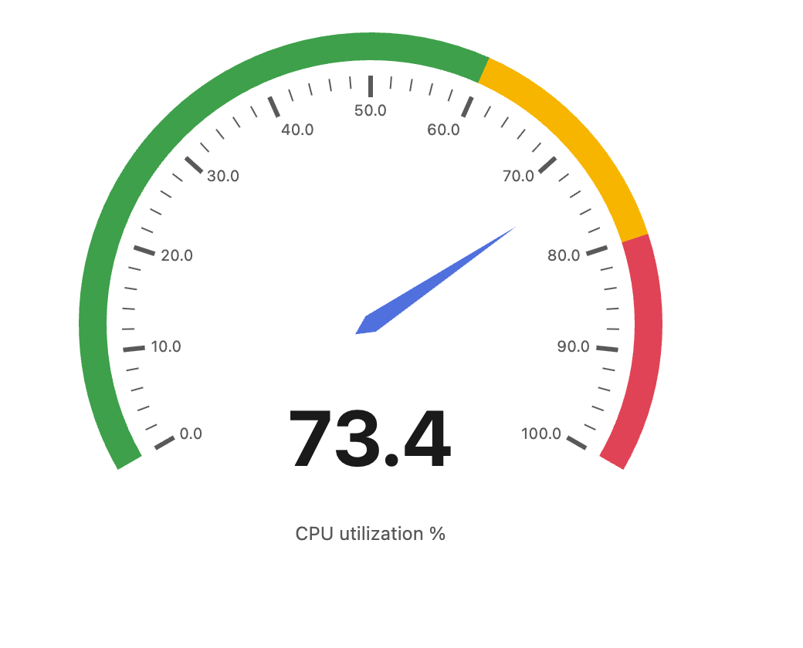 |
| **Sankey** | **Funnel** | **Gauge** |

**Added in v0.4.0** — first wave of the [Superset feature-parity roadmap](./docs/superpowers/specs/2026-04-26-xviz-superset-parity-roadmap.md):

| Chart | Use case | Notes |
|---|---|---|
| **BoxPlot** | Distribution comparison across groups | Tukey or min-max whiskers, optional outlier overlay |
| **Histogram** | Single-column distribution | Equal-width bins, optional density / cumulative modes |
| **Treemap** | Hierarchical part-to-whole | Multi-column `groupby` builds nested tree |
| **Sunburst** | Concentric-ring hierarchy | Same data contract as Treemap |
| **Radar** | Multi-axis comparison | Each metric → one axis; each group → one polygon |

Plus **BigNumber** (KPI tile with trendline + % delta) and light/dark themes:

<p align="center">
  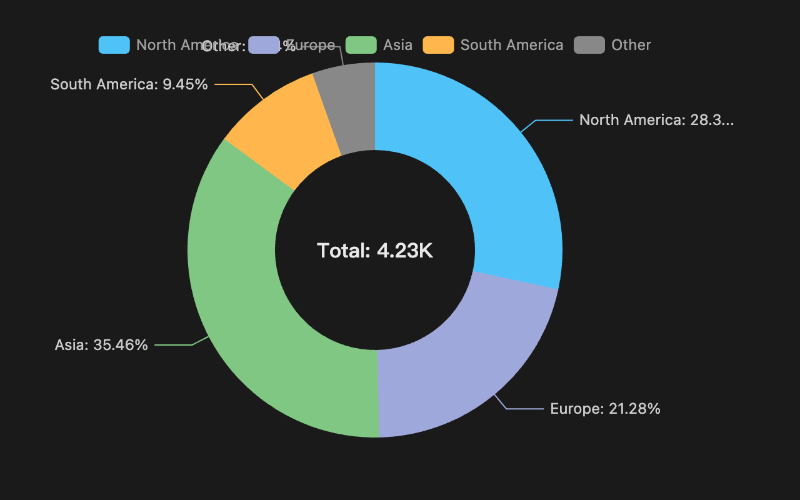
  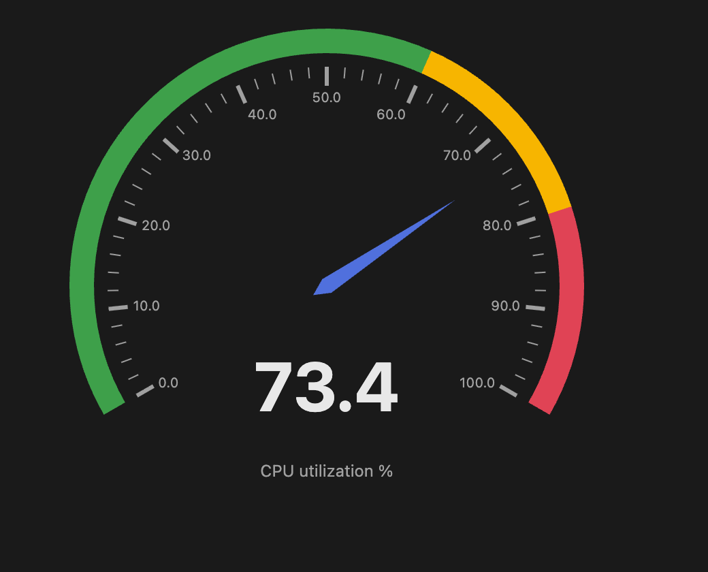
</p>

## CSV compatibility

The CSV parser handles the edge cases BI tools produce — UTF-8 BOM,
thousands-separated numbers (`"9,823,456"`), nested double quotes,
CSV-injection escaping, aggregate column names like `SUM(x)` and
`__timestamp`. 16 regression tests cover real-world export shapes.

## What this is **not**

xviz is not a BI platform. No dashboards, no permissioning, no saved
queries, no metadata DB. It's the "I have some data, I want a chart"
part of the problem — nothing more.

## Learn more

- 📖 **[Technical deep dive](./docs/blog/2026-04-24-extracting-superset-viz.md)**
  — architecture, trade-offs, side-by-side comparisons
- 🧩 **[minimal-viz library docs](./minimal-viz/README.md)** — full API, theming, all 15 chart types
- 🛠️ **[xviz CLI docs](./xviz-cli/README.md)** — `render`, `query`, `serve`, `mcp` commands
- 🧪 **[Runnable examples](./xviz-cli/examples/README.md)** — Postgres, SQLite, CSV, MCP, HTTP
- 🤝 **[Contributing](./CONTRIBUTING.md)** — bug reports, PRs, dev setup
- 📜 **[Code of Conduct](./CODE_OF_CONDUCT.md)**

## License

Apache 2.0
