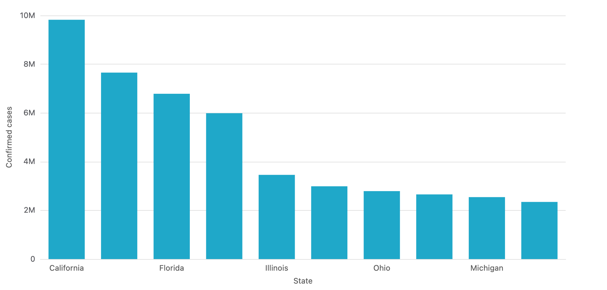

# xviz — Superset-quality charts, Superset-free

<p align="center">
  
</p>

> A lightweight React + ECharts charting library **plus** a headless CLI that
> turns JSON, CSV, or SQL into PNG / PDF / HTML. Ships an HTTP server and an
> MCP server for LLM tool-use. Inspired by Apache Superset's visualization
> layer, but without its backend.

## Why?

Rendering a Superset-quality chart in your own app shouldn't require
15 MB of transitive deps, a backend, or a downgrade to React 16.

- `@superset-ui/plugin-chart-echarts` on npm is **several years behind**
  the Superset monorepo and still targets React 16 APIs.
- It drags in **antd v4 + antd v5 + emotion + react-ace + chart-controls + …**
- There's **no CLI, no HTTP endpoint, no LLM integration** — Superset
  assumes you'll use its dashboard UI.

This repo vendors just the core chart transforms, re-wraps ECharts in 70
lines, and ships the result as a clean React library + a headless renderer
you can shell out to.

## The charts

Ten chart types covering ~80% of everyday BI needs.

| | | |
|:---:|:---:|:---:|
|  |  |  |
| **Pie / Donut** | **Bar (stacked)** | **Line (smooth + area)** |
|  |  |  |
| **Table** | **Scatter / Bubble** | **Heatmap** |
|  |  |  |
| **Sankey** | **Funnel** | **Gauge** |

Plus **BigNumber** (KPI tile with trendline + % delta) and light/dark themes:

<p align="center">
  
  
</p>

## Three ways to use it

### 1 · As a React library

```bash
npm install @minimal-viz/core react react-dom echarts
```

```tsx
import { PieChart } from '@minimal-viz/core'

<PieChart
  width={600} height={400}
  formData={{ vizType: 'pie', groupby: ['region'], metric: 'sales', donut: true }}
  queriesData={[{ data: [
    { region: 'NA', sales: 1200 },
    { region: 'EU', sales:  900 },
    { region: 'AS', sales: 1500 },
  ]}]}
/>
```

See the [library docs →](./minimal-viz/README.md)

### 2 · As a CLI

```bash
cd xviz-cli && npm install && npm run build

# From JSON or CSV (Superset's Export to CSV works unmodified)
xviz render -d data.csv -f form.json -o chart.png

# Straight from a database
xviz query --db sqlite:./orders.db \
  --sql "SELECT region, SUM(revenue) r FROM orders GROUP BY 1" \
  --form pie.json -o regions.png

# Or as an HTTP service — browser stays warm, ~1.2s/request
xviz serve --port 3737
```

See the [CLI docs →](./xviz-cli/README.md)

### 3 · As an LLM tool (MCP)

Ask Claude *"chart these numbers as a donut"* and it calls `render_chart`
directly:

<p align="center">
  
</p>

```json
// Add to Claude Desktop's config:
{ "mcpServers": { "xviz": { "command": "node",
  "args": ["/path/to/xviz-cli/bin/xviz.mjs", "mcp"] } } }
```

## Superset compatibility

The CSV parser reads **real Apache Superset `Export to CSV` output verbatim**
— UTF-8 BOM, thousands-separated numbers, CSV-injection guard (`'+12V` →
`+12V`), nested double quotes, aggregate column names like `SUM(confirmed)`
and `__timestamp`. 16 regression tests pin the behaviour.

<p align="center">
  
</p>

## What this is **not**

xviz is not a BI platform. No dashboards, no permissioning, no saved
queries. If you need those, use [Apache Superset](https://superset.apache.org/)
directly. xviz is for the "I have some data, I want a chart" part of the
problem.

## Learn more

- 📖 **[Technical deep dive](./docs/blog/2026-04-24-extracting-superset-viz.md)**
  — how the Superset visualization layer was extracted, with side-by-side
  comparisons
- 🧩 **[minimal-viz library docs](./minimal-viz/README.md)** — full API, theming, all 10 chart types
- 🛠️ **[xviz CLI docs](./xviz-cli/README.md)** — `render`, `query`, `serve`, `mcp` commands

## License

Apache 2.0
