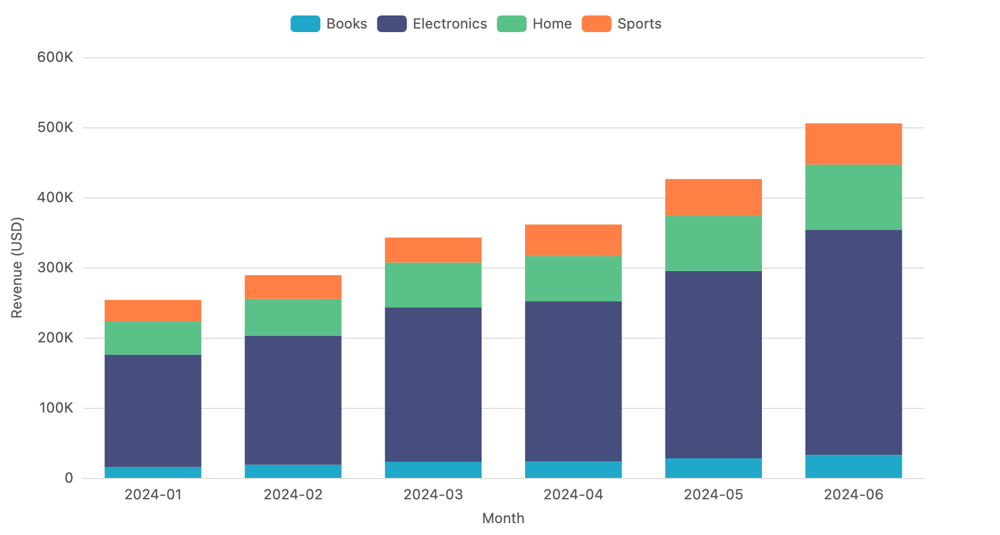
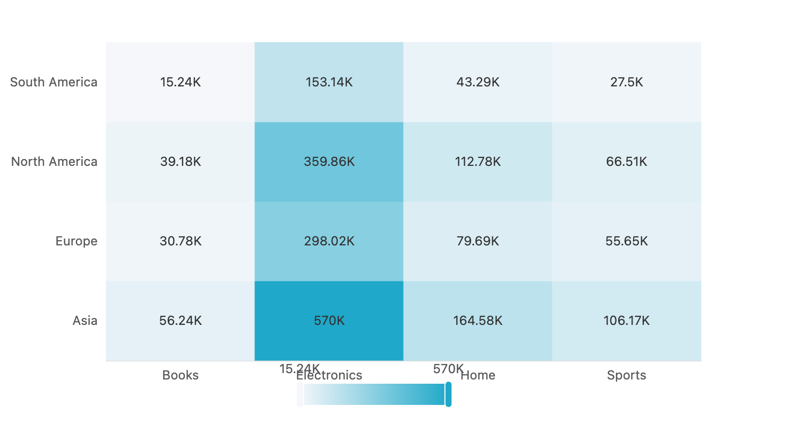

# 从 Apache Superset 里抽出一套独立的可视化层

**2026-04-24** · 逆向工程 / 可视化 / 技术栈瘦身


## 起因:一张饼图的成本

起因很小。我想让一个 React 应用能画 Superset 那种品质的图表,不想带后端。看了下 `npm install @superset-ui/plugin-chart-echarts` 的依赖树,惊了:

- 需要 **React 16**(peer dep 不兼容 React 19,强上 React 18 一堆警告)
- 拖了整个 **antd v4 + antd v5 + emotion + react-ace + chart-controls**,~15 MB
- 发布的 npm 版本 `0.20.4` 落后仓库代码好几年

画一张饼图不该有这么大成本。于是我花了两天,把 Superset 的可视化层拆开重新拼了一遍。成果是:

- **`@minimal-viz/core`** — 10 种图表的 React 库,~5 KB gzipped,3 个运行时依赖(react、react-dom、echarts)
- **`xviz`** — 无头渲染 CLI,JSON/CSV/SQL → PNG/PDF/HTML,并且能作 MCP server 给 LLM 用

这篇文章记录**抽离过程**——从读 Superset 源码到跑通独立渲染用了哪些具体步骤、踩了哪些坑。

---

## 第一步:读懂 Superset 的可视化架构

Superset 前端把"一切可视化单元"(slice)都叫 Chart,统一走一套 Plugin 系统。每个图表类型 = 一个 `ChartPlugin` 子类,注册到 5 个 registry:

| Registry | 装什么 |
|---|---|
| `ChartMetadataRegistry` | 名称、缩略图、行为标签 |
| `ChartComponentRegistry` | 实际渲染的 React 组件 |
| `ChartControlPanelRegistry` | Explore 左侧表单配置 |
| `ChartTransformPropsRegistry` | `formData + data` → 图表库专用 props |
| `ChartBuildQueryRegistry` | (可选) 构建后端 query |

数据到像素的关键路径:

```
ChartProps  { formData, queriesData, width, height, theme }
       │
       ▼
  transformProps  ← 插件专属逻辑(Pie 的 500 行核心在这)
       │
       ▼
  <Chart />       ← 薄薄一层,把 echartOptions 传给通用 <Echart> 组件
```

Pie 插件拆开就是 8 个文件、~1000 行:

| 文件 | 作用 |
|---|---|
| `index.ts` | 注册 + metadata |
| `buildQuery.ts` | 后端 SQL 构造 |
| `controlPanel.tsx` | 表单 UI 定义 |
| `transformProps.ts` | **核心:数据 → ECharts option** |
| `EchartsPie.tsx` | 40 行的 React 组件 |
| `types.ts`, `utils.ts`, `constants.ts` | 支撑 |

**关键发现**:真正"画图"的代码量很小。`buildQuery` 是后端的事(CLI 里用不到),`controlPanel` 是 Explore 里才需要(离线渲染不需要),重头戏全在 `transformProps` 里。

---

## 第二步:两条路的取舍

验证抽离可行性时我试了两条路:

**A 路线:直接用 npm 上的 `@superset-ui/plugin-chart-echarts`**

装完能跑,但付出的代价:
- 13 个 peer dep(emotion、antd v4、antd v5、react-ace、...)
- 必须降到 React 18 才能用(React 19 `contextTypes` 被删)
- ~15 MB `node_modules/`

**B 路线:把 `transformProps` + Echart 包装 vendor 过来,去掉其他**

需要做的工作:
- 把 500 行的 `transformProps.ts` 复制,去掉 Superset 内部工具函数(`CategoricalColorNamespace`、`getValueFormatter` 等),换成自己的极简实现
- 把 326 行的 `Echart.tsx` 重写成 70 行(去掉 Redux `useSelector`、去掉 `@apache-superset/core/theme` 依赖)
- 替代品:自己写 30 行的颜色映射 + 数字格式化工具

工作量相当,但 B 路线的产物干净得多。选 B。

---

## 第三步:10 个图表的生产级实现

按同一套模式实现了 10 种图表。全部用 ECharts 或纯 React 作底层,共享 `<Echart>` 包装器和 `theme` 系统:

### 饼图 (`PieChart`)


保留了 Superset Pie 的所有核心能力:环形、6 种标签格式、小占比合并为 "Other"、中心 Total 标注、玫瑰图。

### 堆叠柱 / 面积折线 (`BarChart`, `LineChart`)

共用一套 `transformCartesianProps`,按 `vizType` 切换 series type。


### 表格 (`Table`)

纯 React,没用 ECharts。支持列排序、分页、数字格式化、斑马纹。


### 散点 + 气泡 (`Scatter`)

支持 `seriesColumn` 按颜色分组、`sizeColumn` 按大小编码,变成气泡图。


### 热力图 (`Heatmap`)

2D 网格,自定义色阶。


### 桑基 + 漏斗 + 仪表 (`Sankey`, `Funnel`, `Gauge`)


**总代码量:1,275 行 TS/TSX**,覆盖 10 种图表 + 类型系统 + 主题系统 + ECharts 包装。

---

## 第四步:主题系统

内置亮暗两套,支持扩展:

```tsx
import { PieChart, DARK_THEME, extendTheme } from '@minimal-viz/core'

const brandTheme = extendTheme(LIGHT_THEME, {
  palette: ['#FF6B35', '#F7C548', '#00A896'],
})

<PieChart theme={DARK_THEME} ... />
```

`<Echart>` 组件里写了个 `applyTheme()` 函数,把主题的文字色、边框色、背景色自动注入到 ECharts option 的 `textStyle / tooltip / legend / xAxis / yAxis`,让单个图表的 `transformProps` 保持主题无关。


---

## 第五步:xviz CLI — 无头渲染

有了 SDK,再套一层 Puppeteer 就是 CLI。关键点:

1. **Vite + `vite-plugin-singlefile`** 把 SDK + 渲染器打成**单个 self-contained HTML**(JS/CSS 全部 inline,无网络请求)
2. CLI 读这个 HTML,用 `page.setContent()` 加载,通过 `<script>window.__CHART__ = {...}</script>` 注入配置
3. 等 React 挂载 + ECharts 画完,`page.screenshot()` 拿 PNG

```bash
xviz render -d data.csv -f form.json -o chart.png
xviz query --db postgres://... --sql '...' -f form.json -o chart.png
xviz serve --port 3737                # HTTP server
xviz mcp                              # LLM 用的 MCP server
```

---

## 第六步:Superset CSV 兼容性

既然思路是"Superset 替代品",那得能直接吃 Superset 的 `Export to CSV` 输出。读了 Superset 源码 `superset/utils/csv.py` 和 config,发现 5 个坑:

| 细节 | 来源 |
|---|---|
| 文件带 **UTF-8 BOM** | `CSV_EXPORT = {"encoding": "utf-8-sig"}` |
| 值以 `-@+|=%` 开头时前缀 `'` 防 Excel 公式注入 | `escape_value()` |
| 千分位数字如 `"9,823,456"` | pandas `to_csv` 数字格式化 |
| 嵌套双引号 `"""Pro"" Kit"` | RFC-4180 标准 |
| `__timestamp` / `SUM(x)` 这样的列名 | 聚合输出 |

手写了 80 行的 CSV 解析器覆盖全部场景,配了 16 条回归测试:

```
✓ strips UTF-8 BOM (encoding=utf-8-sig)
✓ thousands-separated integer: "9,823,456"
✓ CSV-injection guard: "'+12V" → "+12V"
✓ nested double quotes: """Pro"" Kit"
✓ __timestamp column preserved as string
... 11 more ✓
```

实测用真实 Superset 风格的 COVID 统计 CSV 画柱:


---

## 第七步:SQL 直连

`xviz query` 合并 SQL 查询 + 图表渲染到一个命令。驱动按需加载(`pg` / `better-sqlite3` / `mysql2`),不强制安装。

```bash
xviz query \
  --db sqlite:./orders.db \
  --sql "SELECT strftime('%Y-%m', placed_at) AS month,
                product_category AS category,
                SUM(revenue) AS revenue
         FROM orders GROUP BY 1, 2" \
  --form bar-form.json \
  --out monthly.png
```




---

## 第八步:MCP — 让 LLM 画图

最后做了个 MCP server。Claude(或其他 MCP 客户端)可以把 `render_chart` 当 tool 调用,数据自然语言 → 图片:


Claude Desktop 配置:

```json
{
  "mcpServers": {
    "xviz": {
      "command": "node",
      "args": ["/path/to/xviz-cli/bin/xviz.mjs", "mcp"]
    }
  }
}
```

然后对 Claude 说 "把这几个区域的销售数据画成环形图",它就调 tool 返图给你。

---

## 数字盘点

| 指标 | 值 |
|---|---|
| 图表类型 | 10 种 |
| SDK 代码量 | 1,275 行 TS/TSX |
| CLI 代码量 | 580 行 mjs |
| 运行时依赖 | 3 个(react/react-dom/echarts) |
| npm 包大小(gzip) | ~5 KB |
| HTTP 渲染延迟 | ~1.2s/req(browser 常驻) |
| Superset CSV 测试 | 16 项通过 |
| 对比 `@superset-ui/plugin-chart-echarts` | **减少 13 个 peer dep** |
| 对比完整 Superset 前端 | **减少 ~400k 行 TS** |

---

## 取舍与边界

Superset 是 BI 平台,我做的这东西**不是**。刻意放弃掉的:

- ❌ 仪表盘、筛选器联动、权限
- ❌ SQL Lab、explore UI
- ❌ 跨筛选、钻取、右键菜单
- ❌ 66 种图表里 Superset 比我多的 56 种(包括所有 DeckGL 地图)

保留 + 做好的:

- ✅ 10 种 BI 最常用图表
- ✅ 头less渲染(报表/邮件附件/自动截图场景)
- ✅ 3 种消费方式(SDK / CLI / HTTP)
- ✅ 自然语言接口(MCP)

---

## 代码

- [github.com/.../minimal-viz](../minimal-viz/)
- [github.com/.../xviz-cli](../xviz-cli/)
- Apache 2.0

如果你也在"想画一张图但不想拖 Superset/Metabase 整个后端"的场景,这套工具可能省你几天时间。
