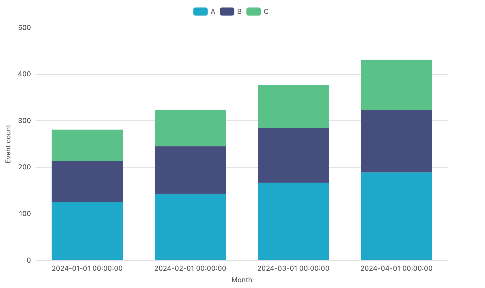

# Example: Superset CSV → stacked bar

Render a stacked-bar chart directly from a CSV exported by Apache
Superset (or any other BI tool that produces CSVs with the same shape).

## What this shows

`xviz render` reads the CSV, applies the `formData` schema, and produces
a stacked-bar PNG. No intermediate transformation, no Python, no Excel.
The CSV parser handles UTF-8 BOM, thousands-separated numbers, nested
quotes, and aggregate column names like `COUNT(*)` and `__timestamp`
(both used in this example).



## Run it

```bash
npm i -g xviz-cli

xviz render \
  -d ../superset-exports/time_series.csv \
  -f ./form.json \
  -o ./chart.png \
  --width 800 --height 500
```

The CSV (`../superset-exports/time_series.csv`) ships with this repo —
it's a small Superset-style export with three columns: `__timestamp`,
`category`, `COUNT(*)`.

## Try other CSVs

- `../superset-exports/ecommerce.csv` — quoted-field / nested-quote stress test, with thousands-separated numbers (`"24,800.00"`)
- `../superset-exports/covid_states.csv` — geographic time series

Each has a matching `*-form.json` next to it. Run any combination via
`../render-all.sh`.

## Form file walk-through

```json
{
  "vizType": "bar",
  "xAxis": "__timestamp",     // column to put on the X axis
  "metrics": ["COUNT(*)"],    // numeric column(s) to plot as bars
  "seriesColumn": "category", // column to break each bar into series
  "stacked": true,            // stack instead of group side-by-side
  ...
}
```

For non-stacked grouped bars, set `"stacked": false`. For a single
metric without breakdown, drop `seriesColumn`.
