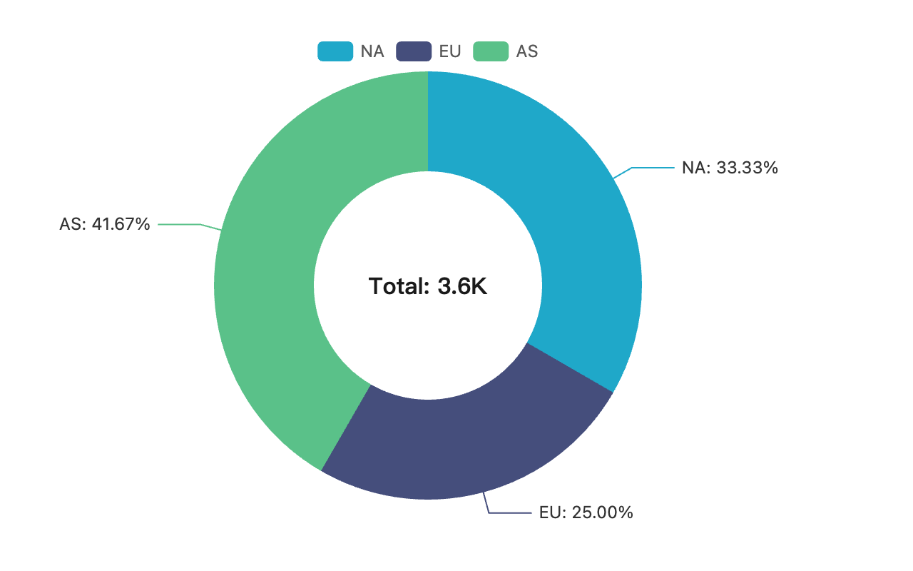

# Example: MCP + Claude Desktop

Wire `xviz` into Claude Desktop as an MCP server, then ask Claude to
render any of the ten chart types.



## Setup

### 1. Install the CLI globally

```bash
npm i -g xviz-cli
```

### 2. Add to Claude Desktop's config

Open the Claude Desktop config (location depends on OS):

- **macOS**: `~/Library/Application Support/Claude/claude_desktop_config.json`
- **Windows**: `%APPDATA%\Claude\claude_desktop_config.json`

Merge the snippet from [`claude_desktop_config.json`](./claude_desktop_config.json)
into your existing config. Full snippet:

```json
{
  "mcpServers": {
    "xviz": {
      "command": "npx",
      "args": ["-y", "xviz-cli", "mcp"]
    }
  }
}
```

### 3. Restart Claude Desktop

After restart, Claude advertises two new tools:

- `render_chart` — renders any of pie / bar / line / table / big-number /
  scatter / heatmap / sankey / funnel / gauge to PNG.
- `list_chart_types` — returns the available types and their formData
  schemas.

### 4. Try it

In a new conversation:

> Render this as a donut pie:
> ```
> NA: 1200
> EU: 900
> AS: 1500
> ```

Claude will call `render_chart` with the right `formData` shape and
render the PNG inline.

## Troubleshooting

- **"xviz-cli command not found"** — `npm i -g xviz-cli` and confirm
  `which xviz` works in a normal terminal. Claude Desktop spawns a
  fresh shell, so anything in `~/.bashrc` won't apply; install
  globally not via nvm-shimmed paths if possible.
- **"Chrome/Chromium not found"** — set `XVIZ_CHROME` in the env block
  of the config:
  ```json
  "xviz": {
    "command": "npx",
    "args": ["-y", "xviz-cli", "mcp"],
    "env": { "XVIZ_CHROME": "/Applications/Google Chrome.app/Contents/MacOS/Google Chrome" }
  }
  ```

## Use with other MCP clients

The same `npx -y xviz-cli mcp` command works with any MCP client
(Cursor, Continue, custom agents). The transport is JSON-RPC over
stdio per the MCP spec.
