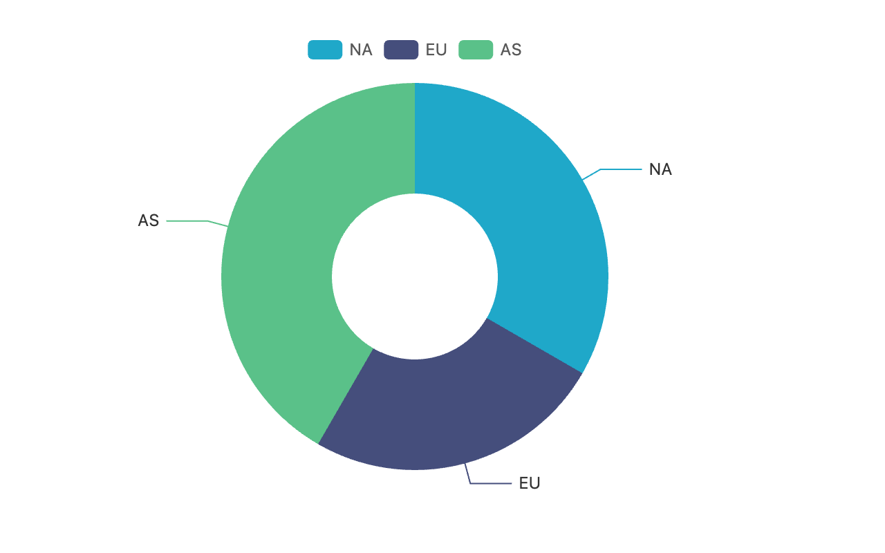

# Example: `xviz serve` + curl

Long-running HTTP server with `POST /render`. Browser stays warm
between requests (~1.2s/render after the first ~3s warm-up).



## Try it

```bash
npm i -g xviz-cli
./run-demo.sh
```

The script:

1. Starts `xviz serve` in the background
2. Polls `GET /health` until ready
3. POSTs [`payload.json`](./payload.json) to `/render`
4. Saves the response as `chart.png`
5. Cleans up the server on exit

## Endpoints

- **`GET /health`** — `{ status: "ok", service: "xviz", endpoints: [...], supported: [...] }`
- **`POST /render`** — body shape: `{ type, data, formData, width, height, theme? }`. Returns the rendered PNG bytes.

## Use cases

- **A serverless function alternative** — keep `xviz serve` running
  behind an internal API gateway; it scales fine for synchronous
  rendering up to a few requests / second per process.
- **A microservice in a multi-service stack** — point Grafana, Slack
  bots, or your own backend at `/render`.

## Production notes

- The default bind is `127.0.0.1` (loopback only). Pass
  `--host 0.0.0.0` to expose to the network.
- The 8 MiB JSON cap on POST bodies is generous for typical chart
  payloads but tight for huge tables — monitor `413` responses.
- One Puppeteer browser is shared across all requests. Render
  throughput is bounded by single-browser concurrency (~3-5 rps in
  practice).
