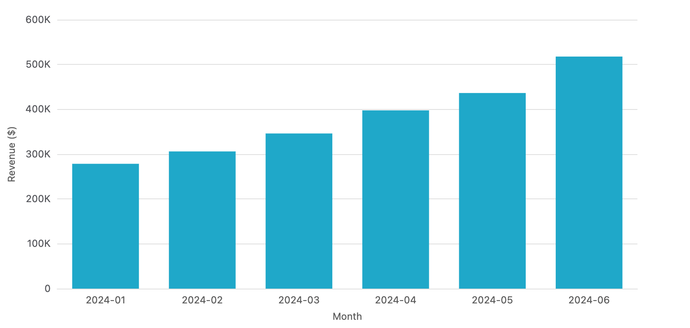

# Example: SQLite + cron daily report

A self-contained shell script that produces a daily PNG report.
Drop it in cron, point it at any SQLite database, and you'll get a
fresh chart on schedule. No Python runtime, no headless service to
maintain.



## Try it

```bash
npm i -g xviz-cli
./daily-report.sh
ls -la reports/
```

The script reads from `../sql/sample.db` (a small synthetic e-commerce
fixture — built lazily by `../sql/build-sample.mjs` if missing).

## Schedule it (Linux / macOS)

```cron
# At 07:00 every morning, render yesterday's revenue chart
0 7 * * *  /path/to/xviz-cli/examples/sqlite-cron/daily-report.sh
```

## Customize

- **Different SQL**: edit the `--sql` flag in `daily-report.sh`.
- **Different chart shape**: swap `form.json` for any of the
  pie / line / scatter / heatmap / etc. forms in the parent directory.
- **Different output destination**: pipe `OUT_PATH` to scp, AWS S3,
  or just write to your static-site assets folder.

## Notes

- Requires Chrome or Chromium at runtime — `xviz` uses `puppeteer-core`.
  Set `XVIZ_CHROME=/path/to/chrome` if needed.
- `reports/` is ignored by git (created on demand by the script).
